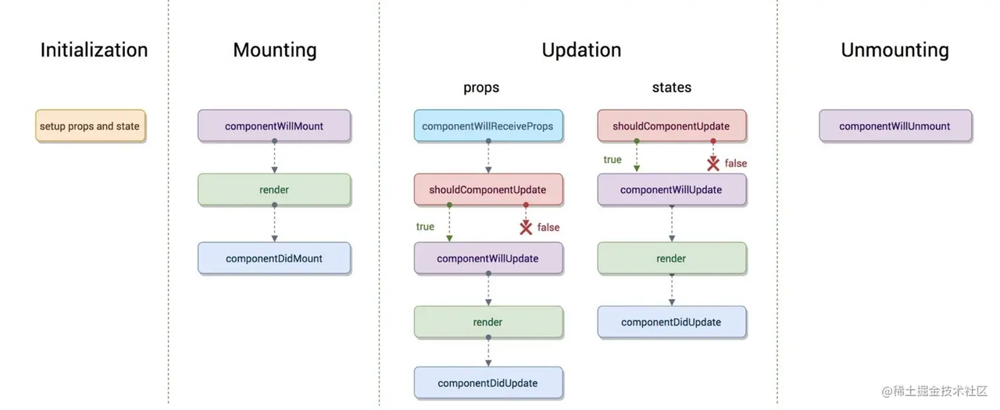

# 类组件

类组件的定义有如下要求：

1. 组件的名称必须要大写字符开头；

2. 类组件需要继承*React.Component;*

3. 类组件必须实现render函数。

```javascript
import React, {Component} from 'react'
export default class App extends Component {
    constructor() {
        super()
        this.state = {
            msg: 'Hello State'
        }
    }
    render() {
        return (
            <div>{this.state.msg}</div>
        )
    }
}
```

# 函数组件

函数组件的特点：

1. 没&#x6709;***this***&#x5BF9;象；

2. 没有内部状态（*state*）；

3. 没有生命周期。

```javascript
import React from 'react'
export default function App() {
    return (
        <div>Hello World</div>
    )
}
```

# 生命周期

从创建到销毁的整个过程被称之为“生命周期”。

生命周期的各个阶段：

1. 装载阶段（*Mount*），组件第一次在DOM树中被渲染的过程；

2. 更新过程（*Update*），组件状态发生变化，重新更新渲染的过程；

3. 卸载过程（*Unmount*），组件从DOM树中被移除的过程。

&#x20;我们谈React生命周期时，主要谈的类的生命周期，因为函数式组件是没有生命周期函数的，但我们可以通过hooks来模拟一些生命周期的回调。



常用生命周期函数需要处理的部分事务：

**Constructer：**

1. 通常给this.state赋值对象来初始化内部的state；

2. 为事件绑定实例（*this*）。

**componentDidMount：**

1. 依赖于DOM的操作可以在这里进行；

2. 在此发送网络请求；

3. 可以在此添加一些订阅。

**componentDidUpdate：**

1. 当组件更新后，可以在此对DOM进行操作；

2. 可以对更新前后的props进行比较，也可以进行网络请求。

**componentWillUnmount：**

1. 在此方法中执行必要的清除操作（例：清除定时器、取消网络请求）；

# 认识组件的嵌套

* App组件是Header、Main、Footer组件的父组件；

* Main组件是Banner、ProductList组件的父组件。

# 组件间的通信

## 父传子

父组件在展示子组件，可能会传递一些数据给子组件：

* 父组件通过 **属性=值&#x20;**&#x20;的形式来传递给子组件数据；

* 子组件通过 **props** 参数获取父组件传递过来的数据。

1. 类组件**父传子：**

```javascript
// Father
import React, { Component } from 'react'
import ChildCpn from './component/ChildCpn'
export default class App extends Component {
  render() {
    return (
      <div>
        <ChildCpn name='Sytus' age='17' height='1.7'></ChildCpn>
        <ChildCpn name='Ming' age='40' height='1.8'></ChildCpn>
      </div>
    )
  }
}
```

```javascript
// Child
import React, { Component } from 'react'
export default class ChildCpn extends Component {
    constructor(props) {
        super(props)
    }
    render() {
        const { name, age, height } = this.props
        return (
            <div>
                <h2>子组件展示数据: {name + ' ' + age + ' ' + height}</h2>
            </div>
        );
    }
}
```

* 函数组件父传子：

```javascript
//Child
import React from 'react'
export function ChildCpn(props) {
    const { name, age, height } = props
    return (
        <div>
            <h2>子组件展示数据: {name + ' ' + age + ' ' + height}</h2>
        </div>
    );
}
```

## 子传父

父组件给子组件传递一个回调函数，在子组件中调用这个函数即可。

希望在子函数中实现对父函数内值的影响，需要在父函数中定义方法传递到子函数中实现。

```javascript
//Father
export default class App extends Component {
    constructor() {
        super()
        this.state = {
            count: 0,
        }
    }
    render() {
        return (
            <div>
                <h2>当前计数：{this.state.count}</h2>
                <CounterBtn plus={e => this.plus()}></CounterBtn>
            </div>
        )
    }

    plus() {
        this.setState({
            count: this.state.count + 1
        })
    }
}
```

```javascript
//Child
class CounterBtn extends Component {
    constructor(props) {
        super(props)
    }

    render() {

        const { plus } = this.props;

        return (
            <button onClick={plus}>+</button>
        )
    }
}
```

# 跨组件通信

## Context的应用

当前Context已经进行了更新，需要查阅[最新文档](https://zh-hans.react.dev/reference/react/createContext)。

# 属性验证

对于传递给子组件的数据，有时我们可能希望进行验证。

1. 导入**prop-types：**

```javascript
import PropTypes from 'prop-types'
```

* 在接收数据的组件中设置验证：

```javascript
import PropTypes from 'prop-types'
export default class ChildCpn extends Component {
    ....
}

ChildCpn.propTypes = {
    name: PropTypes.string.isRequired,
    age: PropTypes.number,
    height: PropTypes.number
}
```

# 组件优化

## shouldComponentUpdate

只能在类组件中进行使用，对render函数的调用进行优化，是一个生命周期函数。

```javascript
shouldComponentupdate(nextProps, nextState) {
    // nextProps是最新的Props
    // nextState是最新的State
    return boolean // true or false, 决定是否执行render()
}
```

## PureComponent

如果类组件继&#x627F;***PureComponent***，则会在组件内部自动实&#x73B0;***shouldComponentUpdate***。

```javascript
import React, {PureComponent} from 'react'

class App extends PureConponent {
    ......
}
```

## memo

**memo**是一个高阶组件，决定函数组件是否重新渲染，可以优化组件性能。

```javascript
import React, {memo} from 'react'

const MemoApp = memo(function App() {
    ......
})

export default MemoApp
```

# Portals

某些情况下，我们希望渲染的内容独立于父组件，甚至是独立于当前挂载到的 DOM 元素中（默认都是挂载到 id 为 root 的 DOM 元素上的）。

Portal 提供了一种将子节点渲染到存在于父组件以外的 DOM 节点的优秀方案。

1. 第一个参数（child）是任何可渲染的 React 子元素，例如一个元素，字符串，或 fragment；

2. 第二个参数（container）是一个 DOM 元素。

```javascript
React.createPortal(child, container)
```

以下进行实例：

* 首先在 index.html 中写入一个新的节点：

```javascript
<body>
  <div id="root"></div>
  <div id="model"></div>
</body>
```

* 再在父组件中传入需要渲染的元素：

```javascript
export default class Portals extends PureComponent {
    render() {
        return (
            <div>
                <h2>Portals</h2>
                <Model>
                    <h2>Model</h2>
                </Model>
            </div>
        )
    }
}
```

* 最后创建一个新的组件，并在内部引入 ReactDOM 后进行操作：

```javascript
import React, { PureComponent } from 'react'
import ReactDOM from 'react-dom'

class Model extends PureComponent {
    render() {
        return (
            ReactDOM.createPortal(
                this.props.children, // 获取所有需要渲染的元素
                document.querySelector('#model') // 挂载到节点上
            )
        )
    }
}
```

# Fragment

通常我们要求一个组件中返回内容时包裹一个 DIV 元素：

```javascript
return (
    <div></div>
)
```

如果我们不希望渲染这个 DIV 元素，那我们就可以使用 Fragment。

```javascript
import React, {Fragment} from 'react'

return (
    <Fragment></Fragment>
)
```

React 提供了 Fragment 的短语法：

* <> \</>

* 但如果需要在 Fragment 中添加 key，则不能使用短语法。

# StrictMode

```javascript
<React.StrictMode>
    <App/> // App组件及子组件开启了严格模式
</React.StrictMode>
```

StrictMode 是一个用来突出显示应用程序中潜在问题的工具：

* StrictMode本身不会渲染任何可见的UI；

* 它为其后代元素触发额外的检查和警告；

* 严格模式检查仅在开发模式下运行，它们不会影响生产构建。

检查内容：

1. 识别不安全的生命周期；

2. 识别过时的 ref API；

3. 检查意外的副作用：

   1. 组建的 constructor() 会被调用两次；

   2. &#x20;这是严格模式下故意的操作，方便程序员查看逻辑代码在调用多次下是否会产生副作用；

   3. 在生产环境中，是不会被调用两次的；

4. 使用废弃的findDOMNode方法；

5. 检测过时的 context API。