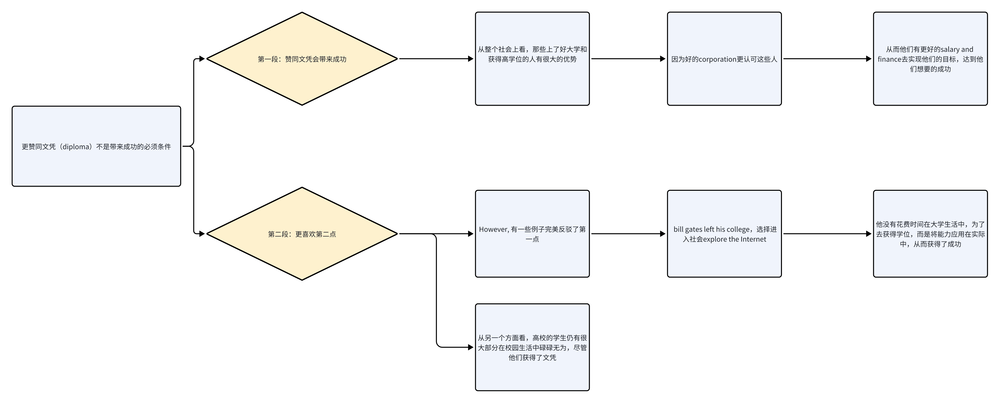

## 观点文

> Some people believe that unpaid community service should be a compulsory part of high school programs (for example working for a charity, improving the neighbourhood or teaching sports to younger children). To what extent do you agree or disagree?

观点文，一般会提出一个社会现象，询问考生是否同意或反对。一般的立场：

* 强烈同意：

  * 2～3个原因支持。

* 强烈反对：

  * 2～3个原因反对。

### 结构

1. Intro：改写问题 + 自己观点；

2. Reason 1：中心句 + 例子；

3. Reason 2：中心句 + 例子；

4. Conclusion：重申观点。

### Intro

> It is sometimes argued that high school programs should require students to do unpaid community service. I completely agree with this opinion.

### Reason 1

> By doing voluntary work, students can learn how to communicate with others and work in a team but also how to manage their time and improve their organizational skills.

### Reason 2

> Meanwhile, they will be encouraged to do something more creative.

### Conclusion

* 套话：**I think this is a good / bad idea, and I hope ......**

> In conclusion, I think this is a very good idea, and I hope this programme will be put into action for high schools and colleges.

## 双边讨论

> Some people believe that educational qualifications will always bring success in life. Other people say that educational qualifications do not necessarily bring success. Discuss both views and give your opinion.

双边讨论，一般会提出两派人有不同的观点，接着询问你的观点。

可以欲扬先抑，先赞同一派观点，再说自己更喜欢另外一个观点。

### 结构

1. Intro：转述题目 + 自己观点；

2. Detail Paragraph 1: 转述自己不同意的观点 + 支持这个观点的理由；

3. Detail Paragraph 2: 自己更喜欢另一方观点 + 理由；

4. Conclusion：虽然有人喜欢 XXX，但我更喜欢 XXX。

### Intro

> People have different opinions about whether diploma can always make people successful or not. From my point of view, I think that educational qualifications are not a crucial factor in obtaining success.
>
> \---
>
> People have different opinions about whether ...... Or not. From my point of view, I think that ......

### DP 1

> The argument in favor of obtaining qualifications is that corporations prefer students with qualifications over those without.
>
> \---
>
> The argument in favor of ...... is that ......

### DP 2

> However, I would agree with those who believe that people do not necessarily have a diploma to achieve success.&#x20;
>
> \---
>
> However, I would agree with those who believe \[观点B陈述]

### Conclusion

> In conclusion, I sincerely think that if people do not have educational qualifications, they may also make their dream come true.

## 利弊文

> Some cities have vehicle-free days, when private cars, trucks, and motorcycles are banned in the city centre. Public transportation like buses, taxis, and metros are advised. To what extent do you think the advantages outweigh the disadvantages?

利弊文，不能一边倒，必须两方面都需要涉及。

### 结构

1. Intro：重述题目 + 自己的立场；

2. Detail Paragraph 1：哪些好处；

3. Detail Paragraph 2：哪些坏处；

4. Conclusion：重述观点。

### Intro

> Vehicle-free days have grown greatly in both social and economic importance, and I think the advantages of this trend outweigh the negatives.
>
> \---
>
> **XX \[套主题词] has grown greatly in both social and economic importance, and I think the advantages / disadvantages of this trend exceed the positives / negatives.**

### DP 1

> Some argue that there are a few drawbacks to vehicle-free days.

### DP 2

> I am, however, in favor of those who believe that the advantages of vehicle-free days exceed the disadvantages.

### Conclusion

> In conclusion, although ......, I believe that ......