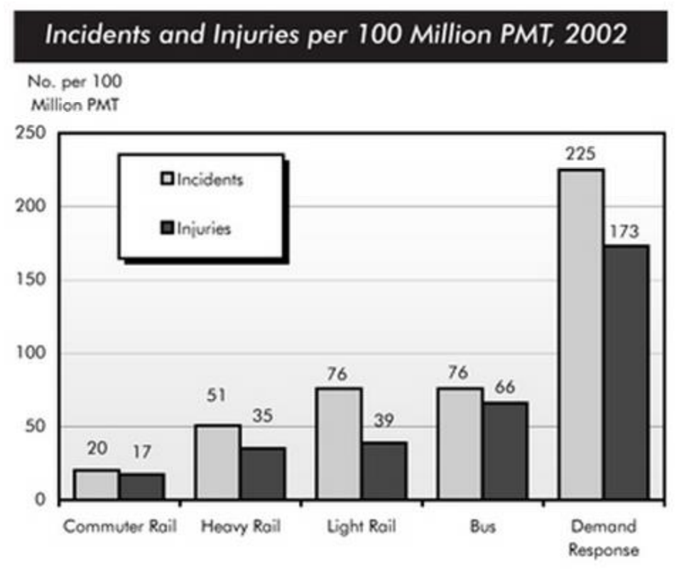
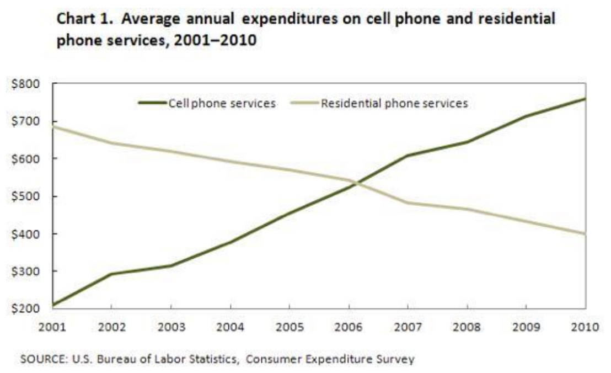

## 动态图

整体结构：

1. Intro：对标题进行重述；

2. Overview：对图表进行概述；

3. Details' Paragraph 1

4. Details' Paragraph 2

### Intro

Intro 的本质是将文章标题进行同义转换，并不需要做太多的事情。

> The graph below shows electricity production in France between 1980 and 2012.

一般的标题都是类似的形式，所以做法非常的公式，速度为王即可。以下是比较常见的替换：

| The graph/table/figure | The given graph       | The chart                 | The line/bar/pie chart           |
| ---------------------- | --------------------- | ------------------------- | -------------------------------- |
| shows                  | illustrates           | compares                  | gives/provides information about |
| Between 1980 and 2012  | Over a xx-year period | Over a period of xx years |                                  |

遇到以产量、数量等相关的信息时，可以使用`the amount of xxx` 进行替换。

> The line chart illustrates the amount of electricity produced in France over a 30-year period.
>
> The given figure compares the amount of elctricity that was produced in Frence over a period of 30 years period.

### Overview

这段主要有两种写法：

1. 讲极值

这个方法适合图表中，最大值与最小值差距显著。

> It is clear that the most incidents and injuries took place on demand-response vehicles. By contrast, commuter rail services recorded by far the lowest figures.&#x20;

* 讲趋势

这个方法适合图表中，不同主体之间趋势差别明显。

> It is clear that spending on landline phones fell steadily over the 10-year period, while mobile phone expenditure rose quickly. The year 2006 marks the point at which expenditure on mobile services overtook that for residential phone services.&#x20;

### Detail Paragraphs

细节段则需要根据实际情况进行分析，但还是有比较万能的开头段：

1. Paragraph 1:

   1. Starting with xxx, ......

2. Paragraph 2:

   1. A similar trend can be found in xxx

   2. Looking at the chart in more detail, we see that ......

   3. It is worth noticing that ......

   4. XXX witnessed a xxx increase/decrease.

      1. XXX witnessed a turning point.

### 词汇与词组

#### 词汇

> 上升：
>
> Increase, grow, rise, jump
>
> 下降：
>
> Fall, drop, decline, dive
>
> 程度：
>
> Slightly&#x20;
>
> Significantly = Dramatically = Sharply
>
> Gradually
>
> Approximately, around, nearly, about
>
> 数量：
>
> Number, amount, figure
>
> 比例：
>
> Proportion, percentage
>
> 最大：
>
> Maximum, peak
>
> 最小：
>
> minimum

#### 词组

> 趋势：
>
> Remain on an upward trend
>
> A downward trend
>
> 上升：
>
> Show a dramatic/significant increase at xxx
>
> An increase/growth/rise in
>
> 下降：
>
> Show a dramatic/significant decrease at xxx
>
> A decrease/drop/decline in
>
> 持平：
>
> Reach a plateau
>
> Remain stable at xxx
>
> 波动：
>
> Flactuate between xxx and xxx
>
> Fluctate around xxx
>
> ......, with slight fluctuation
>
> 时间：
>
> Over xxx years
>
> During the period of xxx
>
> From xxx to xxx
>
> At the beginning of
>
> In the middle of xxx period
>
> At the end of
>
> Following xxx years
>
> ......, after which
>
> Over time, ......
>
> With the passage of time
>
> 高于：
>
> Above, over, more than
>
> 低于：
>
> Below, under, less than
>
> 最大：
>
> 最小：
>
> Reach the minimum

## 静态图

静态图主要可以分为两个大类：流程图和地形图。

整体结构：

1. Intro

2. Overview

3. Details' Paragraph 1

4. Details' Paragraph 2

### Intro

#### 流程图

> The flow chart illustrates the process of…
>
> 这个流程图展示了xx的过程
>
> The diagram provides a step-by-step description of how…
>
> 这个图表提供了对如何xxx的详细步骤描述
>
> This flow chart demonstrates the stages involved in…
>
> 流程图展示了涉及在xxx的阶段

#### 地形图

> The maps illustrate the changes/developments in \[location] over a period of \[time].
>
> The diagrams compare \[location] at two different points in time.

### Overview

#### 流程图

流程图需要注意“阶段”，比如从固体变成液体，这就是阶段的变化，要在Overview中体现出来。

> It is clear that the process consists of \[X] main stages, beginning with \[first stage] and ending with \[last stage]
>
> It is clear that the process is linear/cyclic and involves a series of steps, starting with \[stage] and ending in \[stage].
> It is clear that there are 8 steps, from the raw material to end product. The initial stage is to make \[item] and the later is to \[do what].

#### 地形图

* 地形图的概述段核心：

  * 对比一一讲出变化前后的整体效果

  * 枚举1～3个主要变化

> It is clear that the past \[time] years have (had done / will have done) seen/witnessed an improvement in \[location].
>
> It is clear that after redevelopment/renovation, the town/location will have seen an improvement in surroundings and its road conditions, with the introduction/construction/addition of A, B and C.

### Detail Paragraphs

#### 流程图

> Looking at the first stage, ......
>
> Starting with ......, ......
>
> At the second stage of the process,

#### 地形图

> Looking at the first map, ....
>
> In the second map, ......

### 词组与词汇

#### 流程图词汇

> 状态
>
> Liquid, gas, solid
>
> Raw material, semi-finished product, finished product
>
> 物品
>
> Container
>
> 温度
>
> at 5 degrees Celsius&#x20;
>
> 空气
>
> Intake air
>
> Exhaust, release air
>
> 排水
>
> drain water
>
> 添加
>
> Add into
>
> 移动
>
> be transferred to